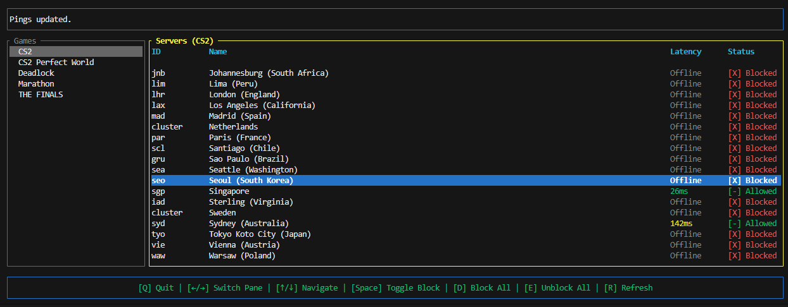

# serverare

serverare (server + netorare)

a tool that can block steam datagram relays so you get to choose the server to queue for in CS2 and a few other games.

it supports Linux and Windows. 



## setup

> if you don't want to build from source, you can skip this and you can open releases page for a windows & linux prebuilt (.exe and such).

### make sure you have rust!

1. then run these:
   ```bash
   git clone https://github.com/yuvlian/serverare.git
   cd serverare
   cargo build --bin serverare --release
   ```
2. run the binary as admin/root:
   ```bash
   # windows (from an elevated terminal or just double click the .exe i guess)
   ./target/release/serverare.exe

   # linux
   sudo ./target/release/serverare
   ```

### note:
   I have tested it on linux mint and windows 11

   for linux you might have to run `sudo sysctl -w net.ipv4.ping_group_range="0 2147483647"` first because I did too.

## how it works

the tool fetches Valve's SDR (Steam Datagram Relay) server list via the Steam Web API using game definitions in `server_definitions.json` (auto-generated on first run).

it shows each server's location, IPs, and live ping in a TUI.

you can toggle individual servers blocked or block/unblock all at once. blocking works by adding firewall rules:

- **windows**: `netsh advfirewall` outbound block rules
- **linux**: `iptables INPUT -s <ip> -j DROP`

a local blocklist is persisted to `serverare_blocklist.json`.

## structure

```
common/       shared types (serde models, errors, etc.)
firewalls/    firewall abstraction (netsh/iptables) + blocklist db
pinger/       ICMP ping probing
serverare/    the TUI app
```

you can see all deps used in workspace Cargo.toml

## controls

| key | action |
|---|---|
| `q` | quit |
| `leftarrow/rightarrow` | switch pane |
| `uparrow/downarrow` | navigate list |
| `space` | toggle selected server block |
| `d` | block all servers |
| `e` | unblock all servers |
| `r` | refresh ping |

## misc

1. **why admin/root?**

   modifying firewall rules requires elevated privileges. the app checks on startup and exits early if not elevated.

2. **supported games?**

   CS2, CS2 Perfect World, Deadlock, Marathon, THE FINALS, configurable via `server_definitions.json`.

3. **file size?** 

   compiled with `rustc 1.97.0-nightly` & release profile:
   - 2,5 MB (2.464.920 bytes) on linux
   - 2.00 MB (2,105,344 bytes) on windows

4. **reference?**
   
   i used this project as a reference: https://github.com/FN-FAL113/server-picker-x. i made this project because i didnt like how bloated it was. i also struggle with reading C# codebases so yeah, forking isnt an option for me.

5. **wow, do u have another tool that u made more lightweight?**

   actually yes, check out https://github.com/yuvlian/sswitch.
   
   its a 0 dependency CLI crossplatform (win,lnx,mac) steam account switcher.
   
   you can just do `win+R` then `sswitch alt1` to switch accounts! how convenient is that?
